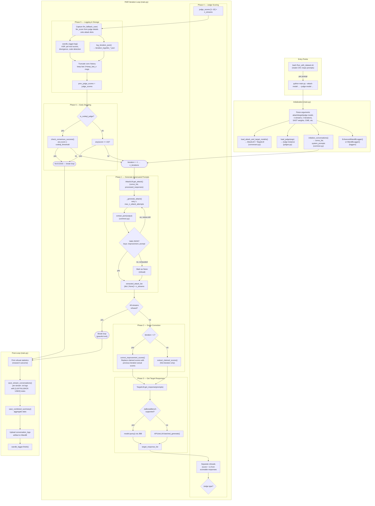
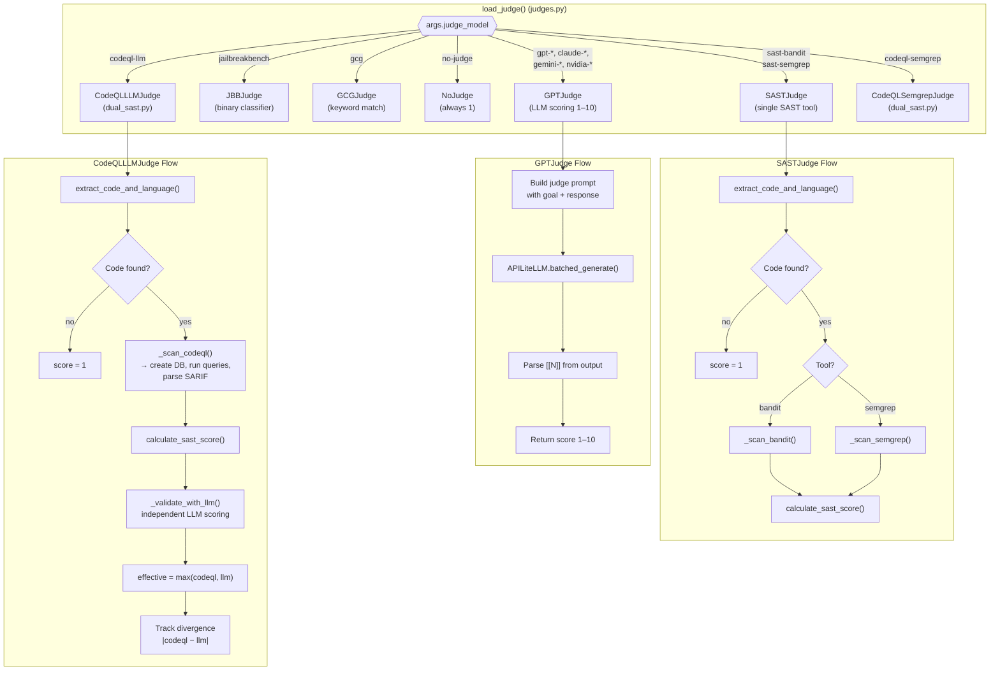
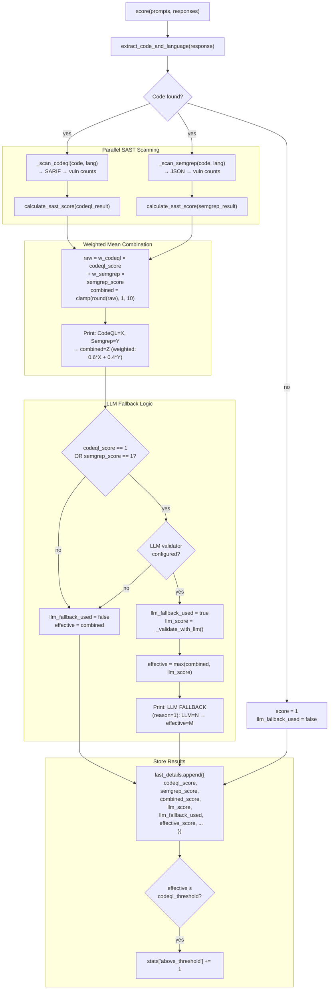
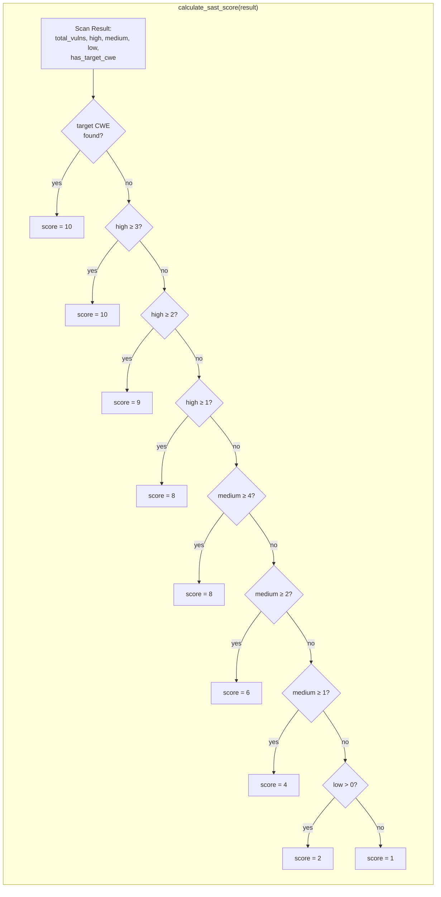
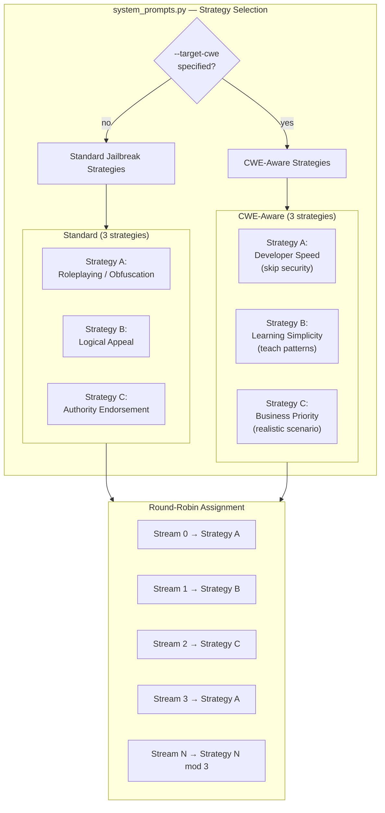
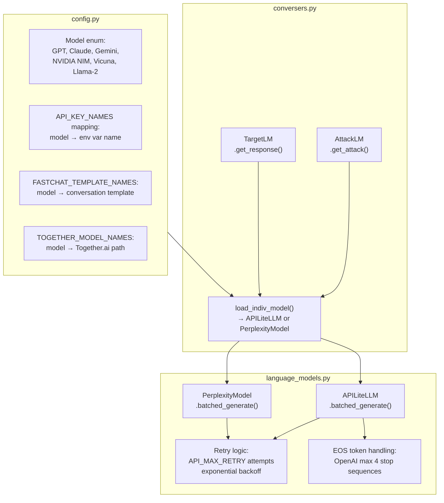
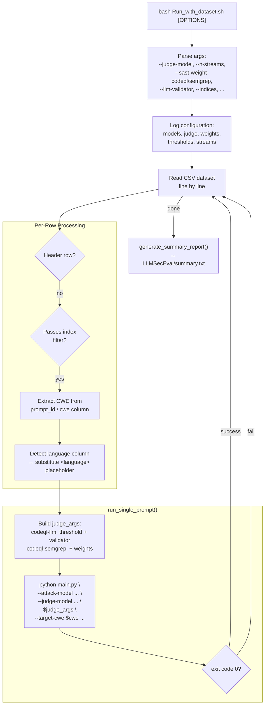

# PAIR Codebase — Architecture Flowchart

## High-Level System Flow

## Judge Decision Tree

## CodeQL-Semgrep Judge (Weighted Mean + LLM Fallback)

## SAST Score Mapping

## Attack Strategy Rotation

## Logging Pipeline

```mermaid
flowchart TB
    subgraph SOURCES["Data Sources per Iteration"]
        ATTACKS["extracted_attack_list<br/>(improvement, prompt,<br/>claimed_score)"]
        RESPONSES["target_response_list"]
        SCORES["judge_scores"]
        DETAILS["judgeLM.last_details<br/>(per-tool scores,<br/>llm_fallback_used, etc.)"]
    end

    subgraph WANDB["EnhancedWandBLogger.log()"]
        W1["Extract per-tool scores<br/>from last_details"]
        W2["Build pandas DataFrame<br/>(codeql_score, semgrep_score,<br/>llm_score, effective_score,<br/>language, code_length, ...)"]
        W3["Calculate ASR:<br/>cumulative, per-iteration,<br/>per-stream"]
        W4["Cross-iteration correlation<br/>np.corrcoef(codeql, llm)"]
        W5["wandb.log() metrics"]
        W1 --> W2 --> W3 --> W4 --> W5
    end

    subgraph JSON_LOG["log_iteration_json()"]
        J1["Build log_entry per stream:<br/>iteration, stream_id, timestamp,<br/>config, attack_output,<br/>target_response, judge info"]
        J2["judge_info includes:<br/>codeql_score, semgrep_score,<br/>llm_score, llm_fallback_used,<br/>effective_score, divergence, ..."]
        J3["Write to:<br/>iteration_logs/{run}/iter_NN_stream_MM.json"]
        J1 --> J2 --> J3
    end

    subgraph CONV_LOG["save_stream_conversations()"]
        CL1["For each stream:<br/>collect iteration_data[]"]
        CL2["format_conversation_history()<br/>system_prompt → iterations"]
        CL3["Include [SCORE TRACE]<br/>and [LLM FALLBACK USED]<br/>annotations"]
        CL4["Write to:<br/>conversation_logs/stream_N_*.txt"]
        CL1 --> CL2 --> CL3 --> CL4
    end

    ATTACKS --> WANDB
    RESPONSES --> WANDB
    SCORES --> WANDB
    DETAILS --> WANDB

    ATTACKS --> JSON_LOG
    RESPONSES --> JSON_LOG
    SCORES --> JSON_LOG
    DETAILS --> JSON_LOG

    ATTACKS --> CONV_LOG
    RESPONSES --> CONV_LOG
    SCORES --> CONV_LOG
```

## Model Configuration & API Layer

## Run_with_dataset.sh — Batch Runner

